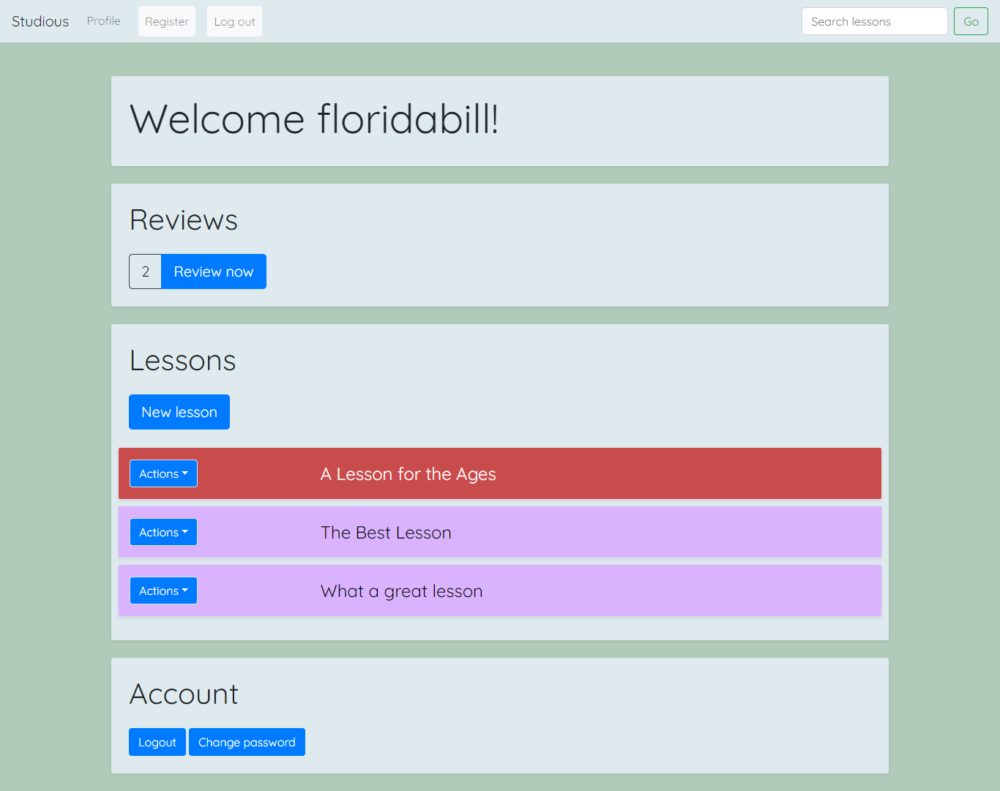

# [Studious](https://studious-carrot.herokuapp.com/)

### A web platform for creating, reviewing, and sharing lessons

- Design customized lessons and reviews in Markdown
- Publish, share, and search for lessons
- Review efficiently using [Spaced Repetition](https://en.wikipedia.org/wiki/Spaced_repetition)

### Infrastructure

This website is deployed to Heroku.
Static assets are hosted and served through AWS S3.
It runs a Django app on a Gunicorn server using a PostgreSQL database.

Deploy process:
1. Push static files to the S3 bucket
2. Push updated code to Heroku repo

